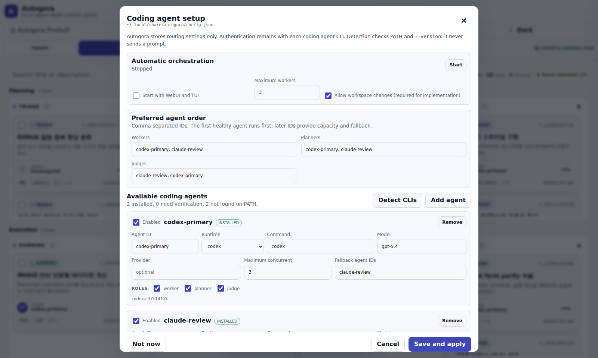

# Autogora 설치 및 업그레이드

Autogora는 아직 정식 릴리스 전이므로 소스 빌드를 기본 설치 경로로 사용한다. 빌드한 단일 실행 파일에는 TUI, Web UI, SQLite 엔진이 들어 있어 별도 데이터베이스 서버나 Web UI 설치가 필요하지 않다.

## 1. 소스에서 빌드

Go 1.25 이상과 Git을 준비한다. `make verify`의 race 검증에는 해당 플랫폼의 C 컴파일러도 필요하다.

```bash
git clone https://github.com/nn1a/autogora.git
cd autogora
make build
./bin/autogora version
```

`make build`는 `CGO_ENABLED=0`으로 `bin/autogora`를 만든다. Linux나 macOS에서 시스템 `PATH`에 설치하려면 다음과 같이 복사한다.

```bash
sudo install -m 0755 ./bin/autogora /usr/local/bin/autogora
autogora version
```

Windows에서는 Go 명령으로 실행 파일을 만들고 `bin` 디렉터리를 사용자 `PATH`에 추가한다.

```powershell
New-Item -ItemType Directory -Force .\bin | Out-Null
go build -trimpath -buildvcs=false `
  -gcflags "github.com/nn1a/autogora/internal/...=-l" `
  -gcflags "github.com/charmbracelet/...=-l" `
  -gcflags "github.com/modelcontextprotocol/...=-l" `
  -gcflags "github.com/google/jsonschema-go/...=-l" `
  -ldflags "-s -w -buildid=" -o .\bin\autogora.exe .\cmd\autogora
.\bin\autogora.exe version
```

변경 사항을 검증하려면 다음 명령을 실행한다.

```bash
make verify
```

## 2. 향후 릴리스 바이너리

향후 태그 릴리스에는 [GitHub Releases](https://github.com/nn1a/autogora/releases)에 아래 아카이브와 `checksums.txt`를 게시할 예정이다. 빌드 스크립트는 이 파일을 이미 생성한다. 릴리스가 없다면 1절의 소스 빌드를 사용한다.

| 환경 | 산출물 이름 |
| --- | --- |
| 일반 Linux x86-64 | `autogora_<version>_linux_amd64.tar.gz` |
| 일반 Linux ARM64 | `autogora_<version>_linux_arm64.tar.gz` |
| Alpine/musl x86-64 | `autogora_<version>_linux_musl_amd64.tar.gz` |
| Alpine/musl ARM64 | `autogora_<version>_linux_musl_arm64.tar.gz` |
| macOS Intel | `autogora_<version>_darwin_amd64.tar.gz` |
| macOS Apple Silicon | `autogora_<version>_darwin_arm64.tar.gz` |
| Windows x86-64 | `autogora_<version>_windows_amd64.tar.gz` |
| Windows ARM64 | `autogora_<version>_windows_arm64.tar.gz` |

Linux 산출물은 모두 `CGO_ENABLED=0`인 정적 실행 파일이며 glibc나 musl에 동적으로 연결하지 않는다. Alpine에서 구분이 필요한 배포 절차에는 `linux_musl_*` 이름의 산출물을 사용한다.

릴리스 파일은 다음 명령으로 직접 만들 수 있다. 대상 `release/` 디렉터리는 비어 있어야 한다.

```bash
make release VERSION=v0.1.0
```

스크립트는 경로·심볼·Go build ID를 제거하고 internal, Charmbracelet, MCP, JSON Schema 패키지의 인라인만 줄인다. 실행 파일이 16MiB를 넘으면 빌드를 중단하며 `gzip -9n`으로 gzip 헤더의 원본 이름과 시간을 제거한다. 한도를 의도적으로 바꿀 때만 `MAX_BINARY_BYTES`를 지정한다.

```bash
MAX_BINARY_BYTES=18874368 make release VERSION=v0.1.0
```

릴리스 아카이브가 생긴 뒤에는 `checksums.txt`로 검증하고 압축을 푼다.

```bash
grep 'autogora_<version>_<platform>_<architecture>.tar.gz' checksums.txt | sha256sum -c -
tar -xzf autogora_<version>_<platform>_<architecture>.tar.gz
```

macOS에서는 `sha256sum` 대신 `shasum -a 256 -c -`를 사용할 수 있다. 파일의 출처와 체크섬을 확인한 뒤 macOS 격리 속성을 지워야 한다면 다음 명령을 실행한다.

```bash
xattr -d com.apple.quarantine /usr/local/bin/autogora
```

## 3. 최초 실행과 데이터 위치

Autogora를 사용할 프로젝트에서 초기화한 뒤 Web UI 또는 TUI를 연다.

```bash
cd /path/to/project
autogora init
autogora dashboard
# 또는
autogora tui
```

`dashboard`가 출력한 bootstrap URL을 브라우저에서 한 번 연다. 브라우저는 URL 토큰을 HTTP-only 세션 쿠키로 교환한 뒤 토큰 없는 URL로 이동한다. 기본 주소는 `127.0.0.1:8420`이다. Web UI 정적 파일은 실행 파일에 내장되어 있다.

TUI는 별도 HTTP 서버 없이 현재 프로젝트의 SQLite DB를 직접 사용한다. 다른 보드는 `--board <slug>`, 다른 DB는 `--db <path>`로 선택한다.

기본 데이터는 Git 작업 트리 밖의 운영체제별 사용자 데이터 디렉터리에 저장된다. 한 clone의 linked worktree는 상태를 공유하고, 다른 clone은 분리된다. `paths`는 디렉터리나 DB를 만들지 않고 실제 경로만 보여준다.

```bash
autogora paths
```

| 운영체제 | 기본 Autogora 데이터 루트 |
| --- | --- |
| Linux | `$XDG_DATA_HOME/autogora` 또는 `~/.local/share/autogora` |
| macOS | `~/Library/Application Support/autogora` |
| Windows | `%LOCALAPPDATA%\autogora` |

프로젝트별 경로는 다음 구조를 사용한다.

```text
<app-data-root>/projects/<project-name>-<hash>/
├─ autogora.db
├─ attachments/
├─ logs/
├─ workspaces/
└─ boards/<board-slug>/
```

전체 데이터 루트를 바꾸려면 절대 경로의 `AUTOGORA_DATA_HOME`을 설정한다. 특정 명령만 다른 DB로 연결하려면 `--db` 또는 `AUTOGORA_DB`를 사용한다. 우선순위는 `--db`, `AUTOGORA_DB`, 저장한 프로젝트별 위치, 운영체제 기본 위치 순서다.

```bash
export AUTOGORA_DATA_HOME=/absolute/path/to/autogora-data
autogora dashboard --db /absolute/path/to/autogora.db
autogora serve --db /absolute/path/to/autogora.db
```

데이터를 저장소 안에 두어야 한다면 일반 `data/`나 `.git/` 내부 대신 프로젝트 루트의 `.autogora/`를 사용한다.

```bash
autogora init --data-dir .autogora
autogora paths
```

Autogora가 만드는 `.autogora/.gitignore`는 DB와 WAL, 로그, 첨부파일, 작업공간을 Git에서 제외한다. `.git` 내부 경로는 사용할 수 없다. 기본 위치로 돌아가려면 다음 명령을 실행한다.

```bash
autogora init --reset-data-dir
```

위치를 바꿔도 기존 데이터는 이동하거나 삭제되지 않는다. 저장소를 이동하면 Git common directory가 달라져 새 프로젝트 ID를 사용한다. 이전 상태를 이어서 쓰려면 옛 데이터 루트를 다시 연결한다.

```bash
autogora init --data-dir /absolute/previous/dataRoot
```

## 4. coding agent와 supervisor 설정

전역 agent 설정은 worker, planner, judge가 사용할 CLI와 모델을 한 곳에서 관리한다. `autogora agents path`로 `config.json` 위치를 확인할 수 있으며, `AUTOGORA_CONFIG`에 절대 경로를 지정해 위치를 바꿀 수 있다. 이 파일에는 API 키나 로그인 토큰을 저장하지 않는다.

Web UI는 전역 설정 파일이 없을 때 첫 화면에서 `Agents` 대화상자를 자동으로 연다. `Detect CLIs`는 `PATH`에서 `claude`, `codex`, `cline`, `gemini`를 찾고 각 실행 파일에 `--version`만 호출한다. prompt를 보내거나 유료 API를 호출하지 않으며 로그인, 구독 한도, quota도 확인하지 않는다. 자동 실행을 켜기 전에 각 CLI에서 인증과 사용 가능 여부를 따로 확인한다.



*사용할 agent와 역할, model, fallback, 동시 실행 수를 확인한 뒤 자동 orchestration 정책을 저장한다.*

CLI에서도 같은 설정을 관리할 수 있다.

```bash
# 먼저 결과를 확인한다. --save는 PATH에서 찾은 CLI를 전역 목록에 추가한다.
autogora agents detect
autogora agents detect --save

autogora agents set claude-backup \
  --runtime claude \
  --model <model-id> \
  --roles worker,planner,judge

autogora agents set codex-primary \
  --runtime codex \
  --command codex \
  --model <model-id> \
  --roles worker,planner,judge \
  --fallbacks claude-backup \
  --max-concurrent 2

autogora agents defaults \
  --worker codex-primary,claude-backup \
  --planner codex-primary,claude-backup \
  --judge claude-backup,codex-primary

autogora agents supervisor \
  --auto-start=true \
  --max-workers 2 \
  --allow-writes=true
```

각 agent에는 다음 값을 저장한다.

- ID, runtime, 실행 명령
- model과 Cline 등에서 사용할 provider
- `worker`, `planner`, `judge` 역할
- agent별 최대 동시 실행 수
- 사용 불가 시 순서대로 확인할 fallback agent

역할별 기본 목록은 우선순위를 정한다. Worker는 실행 중 agent가 `missing`, `auth_required`, `rate_limited` 상태로 판정되면 fallback을 확인한다. 동시 실행 상한에 도달한 worker task는 다른 agent로 바꾸지 않고 같은 profile로 다시 실행할 수 있도록 재예약한다. Planner와 judge는 사용할 수 없거나 동시 실행 상한에 도달한 agent를 건너뛰고 fallback을 확인한다. 전역 agent의 동시 실행 상한은 같은 데이터 루트를 사용하는 모든 보드와 Autogora 프로세스에서 세 역할을 합산한다. Rate limit은 재시도 횟수를 소모하지 않는다. 실행 도중 파일이 바뀌었거나 commit이 생겼다면 fallback을 시작하지 않고 해당 workspace를 보존한 채 `Blocked`로 전환한다.

`auto-start`를 켜면 `autogora dashboard`와 `autogora tui`가 같은 프로세스 안에서 supervisor를 시작한다. 따라서 일반적인 Web/TUI 사용에는 별도 `autogora dispatch --watch` 프로세스가 필요 없다. Web UI의 `Agents` 대화상자에서 현재 supervisor를 시작하거나 멈출 수도 있다. 명시적인 배치 실행이 필요할 때는 `dispatch --once`, `dispatch --watch`, `dispatch --dry-run`을 계속 사용할 수 있다.

전역 agent 설정은 runtime, 실행 명령, 활성 상태, 역할과 동시 실행 상한을 결정한다. 상단 `Settings`에서 여는 `Board & orchestration`의 profile은 같은 이름의 전역 agent에 model, provider, 설명, 우선순위, fallback을 지정하거나 동시 실행 상한을 더 낮출 수 있다. 전역 runtime이나 명령을 바꾸거나, 비활성 agent를 다시 켜거나, 전역 동시 실행 상한을 높일 수는 없다. 보드 전용 profile은 새로 만들 수 있다.

## 5. Skill 설치와 MCP 등록

Autogora는 `autogora-worker`, `autogora-coordinator` Skill을 내장한다. 별도 패키지 저장소 없이 프로젝트에서 Skill과 MCP를 함께 설정할 수 있다. 적용 전 `--dry-run`으로 변경 내용을 확인한다.

```bash
cd /path/to/project
autogora setup --client codex --dry-run
autogora setup --client codex
```

`--client`는 `codex`, `claude`, `gemini`, `all`을 받으며 여러 번 지정할 수 있다.

```bash
autogora setup --client claude --client codex --dry-run
autogora setup --client all
```

| 대상 | Skill 기본 위치 | MCP 기본 범위 |
| --- | --- | --- |
| Codex | 프로젝트 `.agents/skills/` | user |
| Claude Code | 프로젝트 `.claude/skills/` | local |
| Gemini CLI | 프로젝트 `.agents/skills/` | project |

필요하면 Skill과 MCP를 따로 관리한다.

```bash
autogora skills install --client codex
autogora skills status --client codex
autogora skills uninstall --client codex

autogora mcp register --client codex --dry-run
autogora mcp register --client codex
autogora mcp status --client codex
autogora mcp unregister --client codex
```

사용자 범위에 Skill을 설치하려면 `skills` 명령에 `--scope user`를 사용한다. 통합 설정에서는 `--skill-scope`와 `--mcp-scope`를 따로 지정한다.

```bash
autogora setup --client claude \
  --skill-scope user \
  --mcp-scope project
```

설정 명령은 다음 규칙을 지킨다.

- 각 Skill의 manifest와 SHA-256을 저장하고, 수정했거나 Autogora가 관리하지 않는 파일을 자동으로 덮어쓰거나 지우지 않는다. 내용을 확인한 뒤에만 `--force`를 사용한다.
- 같은 이름의 MCP 등록이 다른 바이너리나 DB를 가리키면 중단한다. 확인 후 교체할 때만 `--replace`를 사용한다.
- `setup`은 Skill과 MCP 양쪽을 먼저 점검한다. 클라이언트 실행 파일 누락이나 충돌을 발견하면 적용하지 않는다.
- MCP 등록은 Autogora 바이너리와 DB의 절대 경로를 저장한다. 경로가 바뀌면 `mcp status`로 확인하고 `mcp register --replace`로 갱신한다.

자세한 옵션은 `autogora help setup`, `autogora help skills`, `autogora help mcp`에서 확인한다.

### 수동 MCP 연결

자동 설정을 쓸 수 없을 때만 아래처럼 절대 경로를 직접 등록한다.

```bash
AUTOGORA_BIN=$(command -v autogora)
autogora paths  # 출력의 database 절대 경로를 아래에 사용한다.
AUTOGORA_DB=/absolute/path/printed/by/autogora/paths

claude mcp add --scope local autogora -- \
  "$AUTOGORA_BIN" serve --db "$AUTOGORA_DB"

codex mcp add autogora -- \
  "$AUTOGORA_BIN" serve --db "$AUTOGORA_DB"

gemini mcp add --scope project autogora "$AUTOGORA_BIN" serve -- \
  --db "$AUTOGORA_DB"
```

설정 파일을 직접 관리한다면 [Claude 예제](../examples/claude.mcp.json)와 [Codex 예제](../examples/codex.config.toml)의 절대 경로만 설치 위치에 맞게 바꾼다.

## 6. MCP가 비활성화된 Cline 연결

수정된 Cline이 다음 계약을 만족하면 dispatcher가 MCP 없이 scoped CLI로 lifecycle을 전달한다. Cline은 `setup`, `skills`, `mcp`의 client 대상에 포함하지 않는다.

- `--json`, `--cwd <path>`, `--auto-approve <boolean>`을 받는다.
- 마지막 위치 인자로 worker prompt를 받는다.
- `AUTOGORA_*` 환경을 상속하는 shell 도구를 제공한다.
- stdout에 NDJSON을 출력하고 정상 turn에서 종료 코드 0을 반환한다.

실행 파일 이름이 `cline`이 아니면 경로를 지정한다.

```bash
export AUTOGORA_CLINE_BIN=/absolute/path/to/modified-cline

autogora create "수정된 Cline CLI 브리지 검증" \
  --assignee cline-worker \
  --runtime cline \
  --workspace "$PWD"
autogora dispatch --once
```

dispatcher는 실행마다 task ID, run ID, claim token을 발급하고 정확한 `autogora heartbeat`, `comment`, `complete`, `block` 명령을 prompt에 넣는다. 다른 task의 lifecycle을 바꾸려는 명령은 거부한다. 전체 계약은 [Cline CLI 브리지 문서](../examples/cline-cli-bridge.md)에 있다.

Cline은 planner로도 사용할 수 있다.

```bash
autogora specify <triage-task-id> --planner-runtime cline
autogora decompose <triage-task-id> \
  --planner-runtime cline \
  --profile "worker:cline:범위가 지정된 작업을 구현하고 검증한다"
```

planner는 도구를 쓰지 않고 구조화 결과를 출력한다. 최종 NDJSON 결과가 스키마를 통과해야 보드에 반영된다.

## 7. 업그레이드와 백업

현재 소스 설치를 갱신할 때는 다음 순서를 권장한다.

1. 실행 중인 `dashboard`, `tui`, 별도 `dispatch --watch` 프로세스를 정상 종료한다.
2. `autogora paths`로 확인한 `dataRoot` 전체를 백업한다.
3. Git에서 적용할 commit이나 tag를 확인하고 소스를 갱신한다.
4. `make verify`, `make build`를 실행한다.
5. 기존 실행 파일을 새 `bin/autogora`로 교체한다.
6. `autogora version`, `autogora diagnostics`를 실행하고 Web UI 또는 TUI를 확인한다.

Web UI는 실행 파일에 내장되어 있고 DB, 로그, 첨부파일 같은 변경 데이터는 데이터 루트에 저장된다. 새 실행 파일은 DB를 열 때 필요한 스키마 migration을 수행한다. 서로 다른 버전의 dashboard나 dispatcher가 같은 DB를 동시에 열지 않도록 관련 프로세스를 모두 종료한 뒤 교체한다.

문제가 생기면 이전 실행 파일과 함께 백업한 데이터 루트를 복구한다. 실행 파일만 낮은 버전으로 바꾸고 새 스키마 DB를 그대로 여는 방법은 권장하지 않는다.
