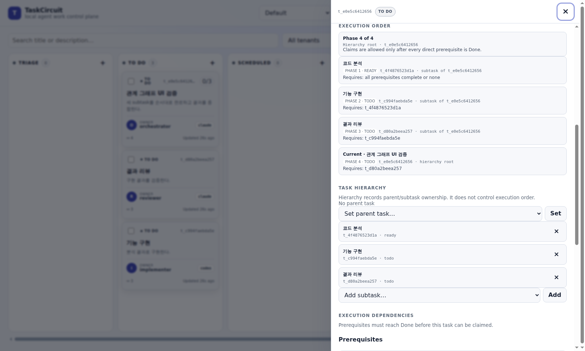
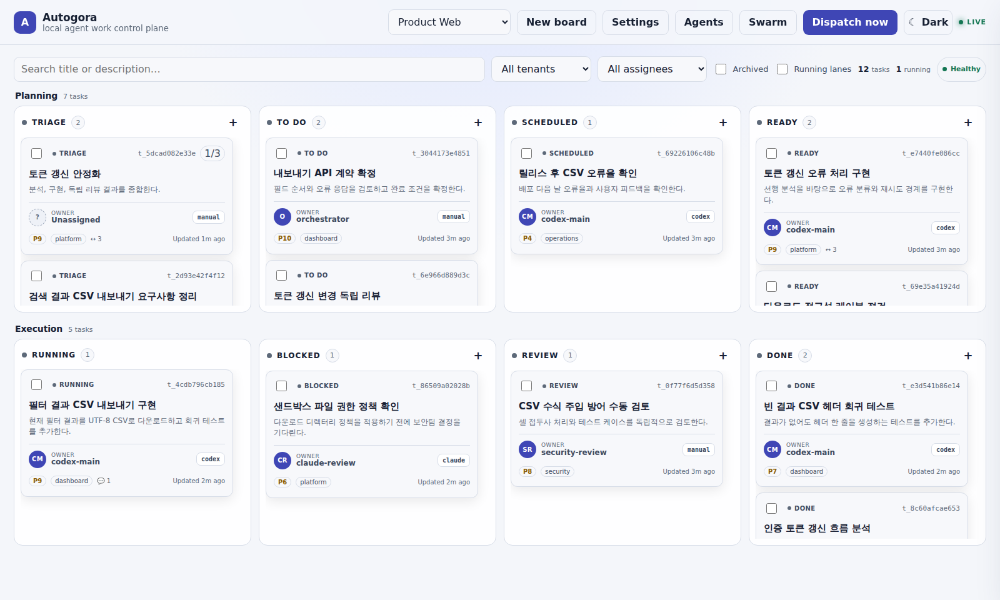
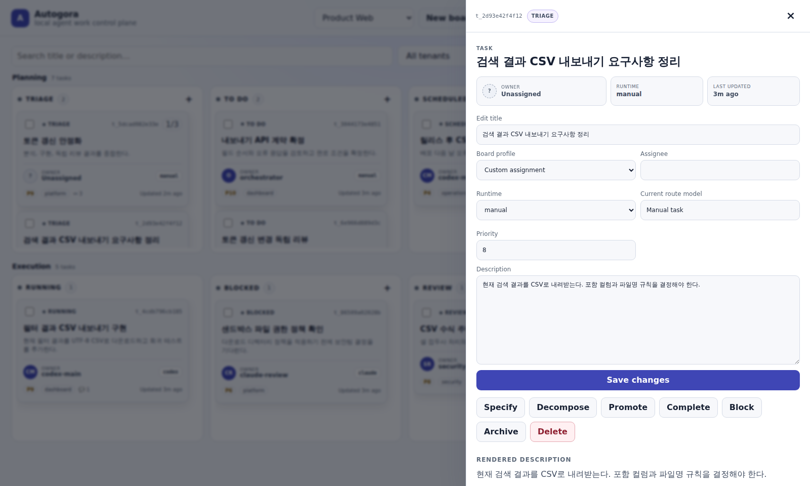
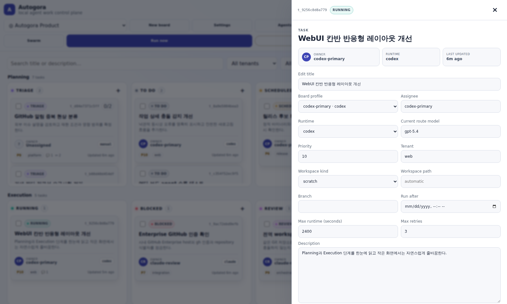
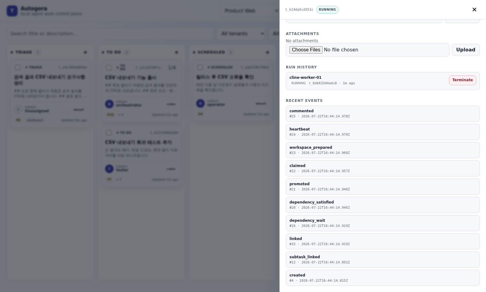
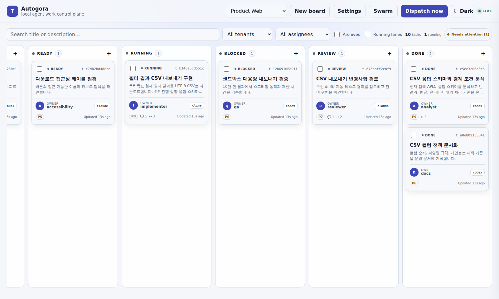

# TaskCircuit 실전 워크플로 가이드

이 문서는 처음 사용하는 사람이 아이디어를 `Triage`에 등록한 뒤 작업을 구체화하고, 에이전트에게 실행시키고, 검증 가능한 결과를 `Done`으로 남기는 방법을 설명한다. Web UI, CLI, MCP 중 어느 화면을 사용해도 같은 SQLite 상태와 전이 규칙을 사용한다.

예제의 `<task-id>`와 `<board>`는 실제 출력값으로 바꿔야 한다. `claude`, `codex`, `cline`, `gemini` 중 설치된 런타임만 사용한다.

## 1. 가장 짧은 성공 경로

기본 경로는 다음과 같다.

```text
Triage ── specify ──> Todo ── promote/조건 충족 ──> Ready
                                                         │
                                                   dispatch/claim
                                                         │
                                                         v
                                                      Running
                                                         │
                                                complete + 검증 근거
                                                         │
                                                         v
                                                       Done
```

처음에는 아래 다섯 단계만 기억하면 된다.

1. 불명확한 요청은 `Triage`에 등록한다.
2. 한 작업이면 `Specify`, 여러 독립 작업이면 `Decompose`를 사용한다.
3. 담당자, 런타임, 작업 디렉터리, 완료 조건을 확인하고 `Ready`로 보낸다.
4. dispatcher가 `Ready` 작업을 claim하여 `Running`으로 만들고 에이전트를 실행한다.
5. 에이전트가 테스트·검증 근거와 함께 완료하면 `Done`이 된다.

## 2. 최초 실행

```bash
npm install
npm run build
node dist/cli.js init
node dist/cli.js dashboard
```

마지막 명령이 출력한 URL을 브라우저에서 연다. 기본 주소는 `127.0.0.1:8420`이며, URL의 일회용 토큰은 세션 쿠키로 교환된다.

별도 터미널에서 실행기를 시작한다.

```bash
# 읽기·분석 작업
node dist/cli.js dispatch --watch --max-workers 2 --board product-web

# 신뢰할 수 있는 코드 저장소에서 구현 작업도 허용
node dist/cli.js dispatch --watch --max-workers 2 --allow-writes --board product-web
```

`--allow-writes`는 에이전트의 파일 수정과 셸 실행을 허용한다. 구현이 필요한 작업에서만, 신뢰하는 저장소를 대상으로 사용한다.

프로젝트별 보드를 먼저 만들면 작업과 실행 이력을 분리하기 쉽다.

```bash
node dist/cli.js boards create product-web \
  --name "Product Web" \
  --default-workdir "$PWD" \
  --switch
```

Git 저장소를 보드의 기본 작업 디렉터리로 지정하고 작업별 경로를 생략하면 dispatcher는 격리된 worktree를 준비한다. 현재 디렉터리를 직접 수정해야 한다면 작업 생성 시 `--workspace "$PWD" --workspace-kind dir`를 명시한다.

### Web UI에서 한 작업을 끝내는 순서

1. `Triage` 컬럼 제목의 `+`를 눌러 요청을 등록한다.
2. 생성된 카드를 눌러 상세 패널을 연다.
3. 한 작업이면 `Specify`, 여러 역할로 나눌 일이면 `Decompose`를 누른다.
4. `Todo` 카드에서 Assignee, Runtime, Priority와 Description을 확인한 뒤 `Save changes`를 누른다. 실행 조건이 모두 맞으면 저장과 함께 `Ready`가 될 수 있다.
5. 여전히 `Todo`이고 `Promote` 버튼이 보일 때만 승격한다. 승격 후에도 `Todo`라면 미완료 dependency나 빠진 담당자를 확인한다.
6. 읽기·분석 작업은 상단의 `Dispatch now`로 한 번 실행할 수 있다.
7. 카드가 `Running`이면 상세 화면의 Run history와 Recent events를 확인한다.
8. 성공하면 `Done`, 사람의 결정이 필요하면 `Blocked`에 도착한다.

Web UI의 `Dispatch now`는 기본적으로 `allowWrites=false`인 읽기 전용 1회 실행이다. 코드나 문서 파일을 수정해야 하는 작업은 별도 터미널에서 다음과 같이 실행한다.

```bash
node dist/cli.js dispatch --once --allow-writes --board product-web
```

## 3. 상태를 읽는 법

| 상태 | 의미 | 일반적인 진입 | 다음 행동 |
| --- | --- | --- | --- |
| `Triage` | 아직 범위·완료 조건·담당 경로가 불명확한 요청 | `create --triage` 또는 UI에서 Triage 선택 | `Specify` 또는 `Decompose` |
| `Todo` | 실행 규격은 있지만 담당자, 런타임, 의존성 또는 수동 승인이 남음 | specify, 미완료 부모 연결, 미할당 작업 | 필드 보완 후 `Promote` |
| `Scheduled` | 미래 시각 또는 수동 재개까지 보류 | `schedule`, `--scheduled-at` | 시간이 되면 자동 승격하거나 `Promote` |
| `Ready` | 지금 claim 가능한 실행 대기 작업 | 담당자·비수동 런타임·의존성 조건 충족 | dispatcher가 claim |
| `Running` | 한 실행이 원자적으로 claim하여 작업 중 | dispatcher 또는 `claim` | heartbeat 후 `Complete` 또는 `Block` |
| `Blocked` | 사람의 입력, 기능 부족, 일시 장애 등으로 진행 불가 | `block` | 원인 해결 후 `Unblock` |
| `Review` | 자동 실행 단계가 아닌 수동 검토 보류 레인 | UI 이동 또는 `edit --status review` | 승인 시 `Complete`, 재작업 시 `Promote` |
| `Done` | 결과와 검증 근거가 남은 완료 상태 | worker `complete` 또는 사람의 완료 처리 | 필요하면 `Archive` |
| `Archived` | 기본 보드에서 숨긴 보관 상태 | `archive` | 일반 목록에서는 제외 |

다음 조건을 만족하면 작업은 `Ready`가 될 수 있다.

- `assignee`가 지정되어 있다.
- 런타임이 `manual`이 아니라 `claude`, `codex`, `cline`, `gemini` 중 하나다.
- 모든 부모 작업이 `Done`이다.
- 예약 시간이 지났거나 예약이 없다.

`Running`은 상태를 직접 수정해서 진입하지 않는다. 반드시 claim을 통해 실행 ID, lease, claim token이 함께 생성되어야 한다.

### 관계 모델과 실행 순서

TaskCircuit은 관계를 두 종류로 분리한다.

| 관계 | 의미 | 실행 순서에 미치는 영향 |
| --- | --- | --- |
| Parent task → Subtask | 어떤 목표를 위해 생성된 하위 작업인지 나타내는 소속 관계 | 직접적인 claim 차단 없음 |
| Prerequisite → Dependent | 선행 작업 결과를 어떤 후속 작업이 소비하는지 나타내는 실행 관계 | 모든 prerequisite가 `Done`이어야 dependent가 `Ready`가 됨 |

Triage 카드를 `Decompose`하면 생성된 모든 작업은 원본 카드의 subtask로 기록된다. 동시에 planner가 만든 dependency DAG가 별도로 저장된다. DAG의 진입점은 병렬로 `Ready`가 될 수 있고, 후속 subtask는 선행 handoff가 완료될 때까지 `Todo`에 머문다. 모든 말단 subtask가 끝나면 원본 root task가 마지막 종합·검증 단계로 `Ready`가 된다.

예를 들어 다음 관계는 hierarchy 하나와 dependency 세 개를 가진다.

```text
Parent task: 릴리스 완료
├─ Subtask: API 계약 검토       Phase 1
├─ Subtask: API 구현            Phase 2
└─ Subtask: 회귀 리뷰           Phase 3

실행 dependency:
외부 승인 → API 계약 검토 → API 구현 → 회귀 리뷰 → Parent task
```

CLI에서 관계를 확인하고 관리할 수 있다.

```bash
# 현재 작업과 연결된 hierarchy, dependency, phase 확인
node dist/cli.js graph <task-id>

# hierarchy만 설정하거나 제거한다. 실행 순서는 바뀌지 않는다.
node dist/cli.js subtask-add <parent-task-id> <subtask-id> --position 0
node dist/cli.js subtask-rm <parent-task-id> <subtask-id>

# 실행 dependency를 추가한다. 첫 번째 ID가 prerequisite다.
node dist/cli.js link <prerequisite-id> <dependent-id>
node dist/cli.js unlink <prerequisite-id> <dependent-id>
```

MCP에서는 `kanban_graph`, `kanban_subtask_set`, `kanban_subtask_remove`, `kanban_link`, `kanban_unlink`를 사용한다. 기존 API의 `parents`/`children` 필드는 호환성을 위해 유지되지만 의미는 각각 `prerequisites`/`dependents`와 같다. hierarchy는 `parentTask`/`subtasks` 필드로 구분된다.

모든 worker에게 전체 graph의 상세 데이터를 전달하지 않는다. 실행 worker가 받는 범위는 다음과 같다.

- root 목표와 현재 subtask 본문
- 현재 phase와 claim 순서 규칙
- 완료된 직접 prerequisite의 summary와 metadata
- 완료 시 열리는 직접 dependent
- 같은 workflow node의 ID, 제목, 상태, phase 요약

다른 subtask의 본문, workspace, 첨부파일, 미완료 결과는 전달하지 않는다. 전체 topology 변경은 orchestrator 또는 관리 화면에서 수행하고, worker는 자신에게 claim된 node만 구현한다.



*실제 Web UI의 관계 관리 화면. 위쪽 phase 목록은 실행 순서를, Task hierarchy는 소속을, Execution dependencies는 claim을 차단하는 선행 관계를 나타낸다.*



*실제 Web UI의 계획 구간. 카드에서 상태, 담당자, 런타임, 우선순위와 갱신 시각을 함께 확인할 수 있다.*

### Review에 대한 중요한 차이

현재 일반 worker가 `kanban_complete`를 호출하면 `Running`에서 바로 `Done`으로 간다. `Review`는 자동 품질 게이트가 아니라 사람이 카드를 잠시 보류하는 레인이다.

필수 리뷰가 필요하면 구현 카드를 억지로 `Review`로 옮기기보다 별도의 리뷰 카드를 만들고 구현 카드를 부모로 연결하는 방식을 권장한다.

```text
분석 작업 ──> 구현 작업 ──> 리뷰 작업
   Done          Done       Ready → Running → Done
```

이 구조에서는 구현 완료 요약과 metadata가 리뷰 worker의 부모 handoff로 자동 전달된다.

## 4. 좋은 카드 작성 규칙

좋은 카드는 worker가 이전 대화를 보지 않아도 실행할 수 있다. 본문에는 최소한 다음 항목을 넣는다.

```markdown
## 목표
사용자가 얻게 될 결과를 한 문장으로 적는다.

## 범위
- 변경하거나 조사할 대상
- 하지 않을 일

## 완료 조건
- 사용자가 관찰할 수 있는 동작
- 생성해야 할 파일 또는 산출물
- 실패·경계 조건

## 검증
- 실행할 테스트 또는 검사 명령
- 리뷰할 diff, 로그, 문서 링크

## 제약
- 수정 금지 영역
- 호환성, 보안, 성능 요구사항
```

제목은 행동보다 결과를 나타내는 편이 좋다.

| 피해야 할 제목 | 권장 제목 |
| --- | --- |
| 버튼 작업 | 검색 필터를 한 번에 초기화하는 버튼 추가 |
| 인증 확인 | 토큰 갱신 흐름과 실패 경로 문서화 |
| 코드 리뷰 | CSV 내보내기 변경의 회귀 위험 검증 |

### Specify와 Decompose 선택 기준

`Specify`를 선택하는 경우:

- 한 worker가 한 workspace에서 끝낼 수 있다.
- 산출물이 하나이고 완료 조건이 동일하다.
- 병렬화보다 단순한 handoff가 중요하다.

`Decompose`를 선택하는 경우:

- 분석, 구현, 검증처럼 역할이 분명히 다르다.
- 서로 독립적으로 병렬 수행할 하위 작업이 있다.
- 후속 작업이 앞선 결과를 명시적으로 소비해야 한다.

작업이 작다면 억지로 쪼개지 않는다. 작은 카드가 너무 많으면 handoff 비용과 상태 관리 비용이 실제 작업보다 커진다.

## 5. Triage에서 Done까지 단계별 운영

### 5.1 Triage: 요청을 잃어버리지 않게 등록

Web UI에서는 `New task`를 누르고 Status를 `Triage`로 선택한다. 아직 담당자를 모르면 비워 두고, 요청 원문과 결정되지 않은 항목을 Description에 남긴다.

CLI 예제:

```bash
node dist/cli.js create "CSV 내보내기 요구사항 정리" \
  --triage \
  --body "현재 검색 결과를 CSV로 내려받아야 한다. 포함 컬럼과 파일명 규칙은 아직 미정이다." \
  --priority 8 \
  --tenant dashboard
```

MCP를 사용하는 Claude/Codex 대화 예제:

```text
TaskCircuit MCP를 사용해서 아래 요청을 product-web 보드의 triage 카드로 등록해줘.
아직 구현하지 말고, 결정되지 않은 사항과 기대 결과를 카드 본문에 구분해서 남겨줘.

요청: 현재 검색 결과를 CSV로 내려받는 기능이 필요하다.
```



*Triage 상세 화면에서는 요청을 수정하고 `Specify` 또는 `Decompose`를 선택할 수 있다.*

### 5.2 Specify: 한 worker가 실행할 수 있게 구체화

보조 planner에게 규격 작성을 맡긴다.

```bash
node dist/cli.js specify <task-id> --planner-runtime codex
```

Cline을 planner로 사용할 수도 있다.

```bash
node dist/cli.js specify <task-id> --planner-runtime cline
```

외부 planner 없이 사람이 확정한 규격을 그대로 넣으려면 `--title`과 `--body`를 함께 사용한다.

```bash
node dist/cli.js specify <task-id> \
  --title "필터 적용 결과를 CSV로 내보내기" \
  --body $'## 목표\n현재 필터 결과를 CSV로 다운로드한다.\n\n## 완료 조건\n- 화면에 Export CSV 버튼이 있다.\n- 현재 필터 결과만 포함한다.\n- UTF-8 CSV를 생성한다.\n- 빈 결과에서도 헤더를 포함한다.\n\n## 검증\n- 단위 테스트와 브라우저 동작을 확인한다.'
```

`Specify`가 끝나면 카드는 `Todo`가 된다. 결과를 반드시 확인한다.

```bash
node dist/cli.js show <task-id>
```

### 5.3 Decompose: 분석·구현·검증 그래프 만들기

```bash
node dist/cli.js decompose <task-id> \
  --planner-runtime codex \
  --profile "analyst:codex:코드와 테스트를 읽고 근거를 남긴다" \
  --profile "implementer:codex:기능을 구현하고 테스트한다" \
  --profile "reviewer:claude:변경을 독립적으로 검증한다" \
  --default-profile analyst:codex \
  --orchestrator-profile implementer:codex
```

planner가 만든 그래프는 한 트랜잭션으로 적용되고 순환 의존성은 거부된다. 결과를 확인하여 제목, 담당자, 런타임과 의존성 방향이 맞는지 검토한다.

```bash
node dist/cli.js show <root-task-id>
node dist/cli.js list --sort status
```

의존성은 `parent → child`, 즉 부모가 먼저 `Done`이어야 자식이 `Ready`가 된다는 뜻이다.

```bash
node dist/cli.js link <prerequisite-id> <dependent-id>
node dist/cli.js unlink <prerequisite-id> <dependent-id>
```

### 5.4 Todo: 실행 경로 확정

`Todo`에서 다음 항목을 확인한다.

- 누가 실행하는가: `assignee`
- 어떤 실행기를 쓰는가: `runtime`
- 어디서 작업하는가: `workspace`, `workspace_kind`, 필요하면 `branch`
- 무엇을 제출하는가: 완료 조건과 artifact 경로
- 무엇이 먼저 끝나야 하는가: prerequisite dependency

필드를 수정한다.

```bash
node dist/cli.js edit <task-id> \
  --assignee implementer \
  --runtime codex \
  --workspace-kind worktree \
  --branch feat/csv-export \
  --priority 10
node dist/cli.js show <task-id>
```

필드 저장 과정에서 조건이 충족되면 자동으로 `Ready`가 될 수 있다. `Specify` 직후처럼 카드가 여전히 `Todo`에 머물러 있을 때만 승격한다.

```bash
node dist/cli.js promote <task-id>
```

승격 후에도 `Todo`라면 미완료 부모, 미할당 담당자, `manual` 런타임을 확인한다.

### 5.5 Ready와 Running: dispatcher에 실행 위임

실행 전 후보를 미리 확인할 수 있다.

```bash
node dist/cli.js dispatch --dry-run --max 3 --board product-web
```

한 건만 실행한다.

```bash
node dist/cli.js dispatch --once --allow-writes --board product-web
```

지속 실행한다.

```bash
node dist/cli.js dispatch --watch \
  --max-workers 2 \
  --max-in-progress 2 \
  --max-per-assignee 1 \
  --allow-writes \
  --board product-web
```

dispatcher는 claim, workspace 준비, worker 실행, heartbeat lease, 제한 시간, 재시도와 종료 상태를 관리한다. worker는 시작할 때 카드와 부모 handoff를 읽고, 오래 걸리는 작업 중에는 heartbeat를 남겨야 한다.



*Running 상세 화면에서 담당자, 런타임, 우선순위와 현재 작업 내용을 확인할 수 있다.*

실행 이력과 로그를 확인한다.

```bash
node dist/cli.js runs <task-id>
node dist/cli.js log <task-id> --tail-bytes 65536
node dist/cli.js tail <task-id> --follow
```



*상세 화면 아래쪽의 Run history와 Recent events에서 claim과 heartbeat를 확인할 수 있다. 비정상 실행은 여기서 종료할 수 있다.*

### 5.6 Blocked: 막힌 이유와 다음 행동을 분리

worker가 계속 진행할 수 없을 때는 이유와 종류를 남긴다.

```bash
node dist/cli.js block <task-id> \
  "샌드박스 API 키와 웹훅 URL 결정이 필요합니다" \
  --kind needs_input
```

종류의 의미:

- `dependency`: 다른 작업 결과를 기다린다. 이 종류는 별도 `Blocked`가 아니라 `Todo` 대기로 돌아간다.
- `needs_input`: 사람의 결정이나 자격 증명이 필요하다.
- `capability`: 현재 runtime이나 도구로 수행할 수 없다.
- `transient`: 일시적인 외부 장애다.

해결한 내용은 comment로 남긴 뒤 재개한다.

```bash
node dist/cli.js comment <task-id> \
  "샌드박스 키를 비밀 저장소에 등록했고 웹훅 URL을 확정했습니다" \
  --author product-owner
node dist/cli.js unblock <task-id>
```

같은 원인으로 반복해서 막히면 카드는 다시 `Triage`로 올라갈 수 있다. 이때는 단순 재시도보다 요구사항이나 실행 경로를 다시 설계한다.

### 5.7 Review: 수동 보류 또는 별도 리뷰 카드

단순한 사람 승인만 필요하면 실행 중이 아닌 카드를 `Review`에 둘 수 있다.

```bash
node dist/cli.js edit <task-id> --status review
```

승인하면 검증 요약과 함께 완료한다.

```bash
node dist/cli.js complete <task-id> \
  --summary "요구사항과 테스트 결과를 확인했고 배포 가능한 상태입니다" \
  --metadata '{"verification":["npm test","manual review"],"residual_risk":[]}'
```

재작업이 필요하면 comment를 남기고 다시 실행 대기열로 보낸다.

```bash
node dist/cli.js comment <task-id> \
  "빈 결과에서 CSV 헤더가 누락됩니다. 회귀 테스트를 추가해 주세요" \
  --author reviewer
node dist/cli.js promote <task-id>
```

`Running` 카드를 행정적으로 `Review`로 바꾸면 활성 run이 회수된다. 실행 중인 worker에게 리뷰를 요청하는 용도로 사용하지 않는다. 필수 코드 리뷰는 별도 리뷰 카드를 만드는 것이 안전하다.

### 5.8 Done: 결과보다 검증 가능한 handoff를 남김

dispatcher가 실행한 일반 worker는 성공 시 `kanban_complete`, 진행 불가 시 `kanban_block` 중 하나로 정확히 한 번 종료해야 한다. 완료 handoff에는 다음 정보를 권장한다.

```json
{
  "summary": "CSV 내보내기와 빈 결과 헤더 처리를 구현했습니다.",
  "metadata": {
    "changed_files": ["web/export.js", "test/export.test.ts"],
    "verification": ["npm test", "manual browser export"],
    "residual_risk": []
  },
  "artifacts": []
}
```

파일 artifact를 선언하면 모든 경로가 workspace 안에 실제로 존재해야 `Done`이 된다. 완료 후 확인한다.

```bash
node dist/cli.js show <task-id>
node dist/cli.js runs <task-id>
```



*실제 결과 구간. Blocked에는 해결해야 할 원인이, Review에는 검토 담당자가, Done에는 완료된 결과가 남는다.*

`Done`은 결과가 검증되었다는 의미다. 단순히 보드에서 숨기려면 `Done` 대신 `Archive`를 사용하지 말고, 완료 후 필요할 때 별도로 보관한다.

## 6. 예제 1: 간단한 기능 구현

목표: 검색 조건을 한 번에 초기화하는 버튼을 구현한다.

### 1단계: Triage 등록

```bash
node dist/cli.js create "검색 필터 초기화 버튼 구현" \
  --triage \
  --body "검색어와 tenant/assignee 필터를 한 번에 초기화해야 한다. 모바일 레이아웃도 유지해야 한다." \
  --assignee implementer \
  --runtime codex \
  --workspace-kind worktree \
  --branch feat/reset-search-filter \
  --priority 10
```

출력의 `task.id`를 저장한다.

```bash
TASK_ID=<task-id>
```

### 2단계: 규격화하고 검토

```bash
node dist/cli.js specify "$TASK_ID" --planner-runtime codex
node dist/cli.js show "$TASK_ID"
```

다음 완료 조건이 본문에 있는지 확인한다.

- 초기화 버튼의 위치와 레이블
- 검색어, tenant, assignee가 모두 초기화됨
- 초기화 후 카드 목록이 즉시 갱신됨
- 키보드 포커스와 모바일 레이아웃 유지
- 관련 테스트와 브라우저 검증

### 3단계: 실행

```bash
node dist/cli.js promote "$TASK_ID"
node dist/cli.js dispatch --once --allow-writes --board product-web
```

### 4단계: 결과 확인

```bash
node dist/cli.js show "$TASK_ID"
node dist/cli.js runs "$TASK_ID"
node dist/cli.js log "$TASK_ID"
```

카드가 `Done`인지, 변경 파일과 실행한 테스트가 completion metadata에 남았는지 확인한다.

MCP 대화로 같은 흐름을 요청하는 예제:

```text
TaskCircuit MCP를 사용해 "검색 필터 초기화 버튼" 요청을 triage로 등록해줘.
한 작업으로 끝낼 수 있으면 specify하고, implementer/codex에 배정해줘.
완료 조건에는 키보드 접근성, 모바일 레이아웃, 관련 테스트를 포함해줘.
계획만 만들고 직접 구현하지는 마.
```

## 7. 예제 2: 코드 분석 후 문서 생성

목표: 인증 코드를 먼저 분석하고, 분석 결과를 사용해 `docs/AUTH_FLOW.md`를 작성한 뒤 정확성을 검토한다.

이 예제는 예측 가능한 세 개의 카드를 직접 만든다. 동일 저장소를 순차적으로 사용하므로 의존성을 반드시 연결한다.

### 1단계: 분석 카드

```bash
node dist/cli.js create "인증 토큰 갱신 흐름 분석" \
  --body $'## 목표\n인증 모듈의 토큰 갱신 흐름을 코드 근거와 함께 분석한다.\n\n## 범위\n- 진입점과 호출 순서\n- 성공/실패/재시도 경로\n- 자격 증명과 로그의 보안 경계\n- 관련 테스트와 누락된 테스트\n\n## 완료 조건\n- 코드는 수정하지 않는다.\n- 완료 요약에 파일 경로와 핵심 근거를 남긴다.' \
  --assignee analyst \
  --runtime codex \
  --workspace "$PWD" \
  --workspace-kind dir
```

```bash
ANALYSIS_ID=<분석-task-id>
```

### 2단계: 문서 생성 카드

```bash
node dist/cli.js create "인증 흐름 문서 작성" \
  --body $'## 목표\n부모 분석 handoff와 실제 코드를 근거로 docs/AUTH_FLOW.md를 작성한다.\n\n## 완료 조건\n- 진입점, 정상 흐름, 실패 흐름, 보안 주의사항을 포함한다.\n- Mermaid 또는 텍스트 순서도를 포함한다.\n- 코드와 다른 추측은 쓰지 않는다.\n- 문서 링크와 검증 내용을 완료 요약에 남긴다.' \
  --assignee writer \
  --runtime claude \
  --workspace "$PWD" \
  --workspace-kind dir \
  --parent "$ANALYSIS_ID"
```

```bash
DOC_ID=<문서-task-id>
```

분석 카드가 완료되기 전에는 문서 카드가 `Todo`에 머문다. 분석이 `Done`이 되면 completion summary와 metadata가 문서 worker의 `Prerequisite handoffs`에 포함되고 문서 카드가 자동으로 `Ready`가 된다.

### 3단계: 문서 검토 카드

```bash
node dist/cli.js create "인증 흐름 문서 정확성 검토" \
  --body $'## 목표\ndocs/AUTH_FLOW.md를 실제 코드 및 테스트와 대조한다.\n\n## 완료 조건\n- 검토 중 파일은 수정하지 않는다.\n- 잘못된 호출 순서나 누락된 실패 경로가 없는지 확인한다.\n- 문서 링크가 유효한지 확인한다.\n- 승인 시 검증 근거와 함께 완료한다.\n- 불일치가 있으면 정확한 파일/구간과 수정 요구를 남기고 block한다.' \
  --assignee reviewer \
  --runtime codex \
  --workspace "$PWD" \
  --workspace-kind dir \
  --parent "$DOC_ID"
```

### 4단계: 순차 실행

```bash
node dist/cli.js dispatch --watch --max-workers 1 --allow-writes --board product-web
```

공유 `dir` workspace에서는 동시에 여러 쓰기 작업을 실행하지 않는다. 분석 → 문서 → 리뷰 의존성 덕분에 이 세 작업은 순서대로 실행된다.

진행 상황 확인:

```bash
node dist/cli.js list --sort status
node dist/cli.js context "$DOC_ID"
node dist/cli.js diagnostics
```

## 8. 예제 3: 분석 → 구현 → 독립 리뷰

목표: API 타임아웃 문제를 분석하고 수정한 뒤 별도 reviewer가 회귀 위험을 검증한다.

### 분석

```bash
node dist/cli.js create "API 타임아웃 원인 분석" \
  --body "재현 경로, 호출 스택, timeout 설정, 재시도 동작과 관련 테스트를 분석한다. 코드는 수정하지 않고 근거를 완료 요약에 남긴다." \
  --assignee analyst --runtime codex \
  --workspace "$PWD" --workspace-kind dir
```

```bash
ANALYSIS_ID=<분석-task-id>
```

### 구현

```bash
node dist/cli.js create "API 타임아웃 처리 개선" \
  --body "부모 분석 결과를 기반으로 최소 변경을 구현한다. timeout과 retry의 상호작용을 테스트하고 npm test를 통과시킨다. 변경 파일, 테스트, 잔여 위험을 완료 metadata에 남긴다." \
  --assignee implementer --runtime codex \
  --workspace "$PWD" --workspace-kind dir \
  --parent "$ANALYSIS_ID"
```

```bash
IMPLEMENT_ID=<구현-task-id>
```

### 리뷰

```bash
node dist/cli.js create "API 타임아웃 변경 독립 리뷰" \
  --body "부모 구현의 diff와 테스트 결과를 검토하되 파일은 수정하지 않는다. 오류 분류, 재시도 중복, 취소 신호, 기존 API 호환성을 확인한다. 승인 시 근거와 함께 complete하고, 결함이 있으면 파일/조건/재현법을 포함해 block한다." \
  --assignee reviewer --runtime claude \
  --workspace "$PWD" --workspace-kind dir \
  --parent "$IMPLEMENT_ID"
```

```bash
REVIEW_ID=<리뷰-task-id>
```

dispatcher를 시작하면 분석만 먼저 `Ready`이고, 각 부모가 `Done`이 될 때 다음 카드가 자동으로 열린다.

```bash
node dist/cli.js dispatch --watch --max-workers 1 --allow-writes --board product-web
```

리뷰가 결함 때문에 `Blocked`되면 재작업 카드를 만들고 리뷰 카드의 새 부모로 연결한다.

```bash
node dist/cli.js create "리뷰 지적 타임아웃 회귀 수정" \
  --body "리뷰 카드의 block reason을 재현하고 수정한다. 집중 테스트와 전체 테스트를 실행한다." \
  --assignee implementer --runtime codex \
  --workspace "$PWD" --workspace-kind dir \
  --parent "$IMPLEMENT_ID"
```

```bash
FIX_ID=<수정-task-id>
node dist/cli.js link "$FIX_ID" "$REVIEW_ID"
node dist/cli.js unblock "$REVIEW_ID"
```

수정 카드가 `Done`이 될 때까지 리뷰 카드는 `Todo`에 머물고, 완료 후 다시 `Ready`가 되어 독립 검증을 반복한다.

## 9. MCP 사용자용 요청 문장 모음

### 요청만 등록

```text
TaskCircuit MCP를 사용해 이 요청을 triage에 등록해줘.
기존 중복 카드를 먼저 검색하고, 구현이나 claim은 하지 마.
요청 원문, 미결정 사항, 기대 결과를 본문에 나눠서 써줘.
```

### 실행 가능한 한 카드로 정리

```text
<task-id> triage 카드를 specify해줘.
범위, 제외 범위, 완료 조건, 검증 명령, 예상 산출물을 명확히 작성하고
결과가 Todo로 이동했는지 다시 show해서 확인해줘.
```

### 분석·구현·리뷰로 분해

```text
<task-id>를 분석 → 구현 → 독립 리뷰 의존성 그래프로 decompose해줘.
analyst/codex, implementer/codex, reviewer/claude 프로필만 사용하고,
각 카드가 부모 completion summary만으로 이어서 작업할 수 있게 본문을 작성해줘.
생성 후 루트와 자식의 상태 및 의존성 방향을 검토해줘.
```

### 보드 상태 점검

```text
TaskCircuit MCP로 현재 보드를 점검해줘.
오래된 Running, 원인 없는 Blocked, 담당자 없는 Todo, 부모가 끝났는데 Ready가 아닌 카드를 찾고
상태를 임의로 바꾸지 말고 먼저 진단 결과와 권장 조치를 알려줘.
```

## 10. 운영 체크리스트

### 작업 시작 전

- 기존 카드와 중복되지 않는가?
- 카드 하나의 결과가 한 문장으로 설명되는가?
- 완료 조건과 검증 방법이 있는가?
- assignee와 runtime이 실제 설치·설정되어 있는가?
- workspace가 안전하고 의도한 저장소를 가리키는가?
- 부모 의존성 방향이 맞는가?

### Running 중

- heartbeat가 갱신되는가?
- `runs`, `log`, `tail`에서 진행 근거를 확인할 수 있는가?
- worker가 범위를 벗어난 파일을 수정하지 않는가?
- 사람의 결정이 필요한데 무의미한 재시도를 반복하지 않는가?

### Done 전

- 완료 조건을 모두 검증했는가?
- 테스트 또는 리뷰 명령이 기록되어 있는가?
- 변경 파일이나 문서 경로가 metadata/artifact에 남았는가?
- 잔여 위험이 명시되어 있는가?
- 필수 리뷰가 별도 카드로 완료되었는가?

## 11. 자주 막히는 원인

### Todo에서 Ready로 가지 않음

```bash
node dist/cli.js show <task-id>
```

다음을 확인한다.

- assignee가 비어 있음
- runtime이 `manual`
- 미완료 parent가 있음
- 예약 시간이 남아 있음
- specify 후 아직 promote하지 않음

### Running이 오래 유지됨

```bash
node dist/cli.js runs <task-id>
node dist/cli.js log <task-id>
node dist/cli.js diagnostics
```

heartbeat, worker PID, claim 만료 시각과 로그를 확인한다. Web UI의 Run history에서 활성 run을 종료할 수도 있다.

### worker가 말만 하고 Done이 되지 않음

일반 worker는 최종 답변만 출력해서는 완료되지 않는다. `kanban_complete` 또는 dispatcher가 제공한 scoped CLI `complete` 명령을 호출해야 한다. MCP가 비활성화된 Cline과 격리된 Gemini worker는 dispatcher prompt에 포함된 정확한 CLI lifecycle bridge를 사용한다.

### Review와 Done의 경계가 모호함

- 단순 사람 승인 대기: 기존 카드를 `Review`에 보류할 수 있다.
- 반드시 독립 실행해야 하는 검증: 별도 리뷰 카드를 만든다.
- 검증 근거 없이 보드만 정리: `Done`으로 만들지 않는다.
- 이미 검증된 완료 카드를 숨김: `Archive`를 사용한다.

## 12. 관찰 명령 요약

```bash
node dist/cli.js list --sort status
node dist/cli.js show <task-id>
node dist/cli.js context <task-id>
node dist/cli.js runs <task-id>
node dist/cli.js log <task-id>
node dist/cli.js stats
node dist/cli.js diagnostics
node dist/cli.js watch --since 0 --follow
```

보드의 canonical state는 TaskCircuit에 있다. 대화 기록에만 결정이나 작업 결과를 남기지 말고 카드 본문, comment, completion summary, metadata 또는 artifact에 durable handoff를 남긴다.
